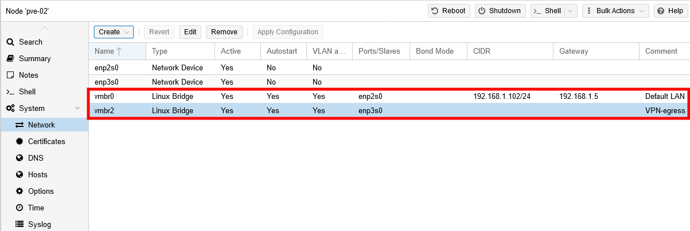
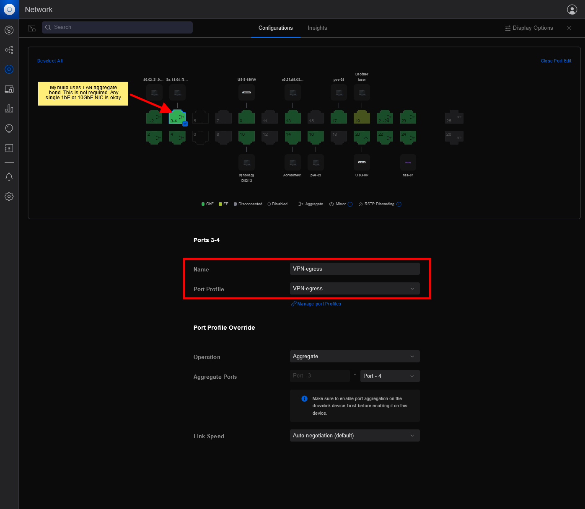

<H1>PVE Host Setup</H1>

This guide is for configuring Proxmox hosts only.

Included are step-by-step instructions and an Easy Script Toolbox to automate much of the work. On completion, your new PVE host is configured to support all Ahuacate CTs and VMs.

The East Script Toolbox add-on "PVE Basic" must be run on all PVE hosts (primary and secondary). "PVE Basic" includes <span style="color:red">critical PVE Container UID & GID mapping required by all Ahuacate CTs and VMs</span> resolving permission rights for bind-mounted shared data.

<h2>Features</h2>

* Step-by-step Proxmox installation instructions
* Configure PVE host networking, hostnames and DNS
* Configure network switches and VLANs

Easy Script Toolbox menu includes the following tasks.

* PVE Basic - required by all PVE hosts (mandatory/required)
    - Update Proxmox
    - Check and set Proxmox subscription key (free or enterprise)
    - Install nbtscan SW
    - Adjust sysctl parameters
    - Perform PVE container (CT) mapping
* PVESM NFS Storage - add additional NFS PVE storage mounts
* PVESM SMB/CIFS Storage - add additional SMB/CIFS storage mounts
* PVE Hostname Updater - change the hostname of a node
* Fail2Ban Installer
* SSMTP Email Installer
* PVE CT updater - mass update all CT OS

<h2>Prerequisites</h2>

**Network Prerequisites**
Network prerequisites are:
- [x] Layer 2/3 Network Switches
- [x] Network Gateway is `XXX.XXX.XXX.5` ( *default is 192.168.1.5* )
- [x] Network DHCP server is `XXX.XXX.XXX.5` ( *default is 192.168.1.5* )
- [x] Internet access for the PVE host
- [x] File server or NAS (i.e NAS-01) . Our default NAS IPv4 address is `XXX.XXX.XXX.10` ( *default is 192.168.1.10* )
- [x] File server or NAS configured with network shares, either CIFS or NFS, as per these guides:
  - OEM (Synology) or Linux NAS [build guide](https://github.com/ahuacate/nas-hardmetal)
  - PVE hosted NAS [build guide](https://github.com/ahuacate/pve-nas)

**Other Prerequisites**
Optional information required running specific Easy Script Toolbox add-ons.

- [ ] SMB/NAS CIFS user account credentials as per these (Only if your adding PVE storage using NAS SMB/CIFS storage mounts)
- [ ] Optional PVE Postfix
  - Email account credentials
  - MailGun account credentials

<h2>Local DNS Records</h2>

We recommend <span style="color:red">you read</span> about network Local DNS and why a PiHole server is a necessity. Click <a href="https://github.com/ahuacate/common/tree/main/pve/src/local_dns_records.md" target="_blank">here</a> to learn more before proceeding any further.

Your network Local Domain or Search domain must be also set. We recommend only top-level domain (spTLD) names for residential and small networks names because they cannot be resolved across the internet. Routers and DNS servers know, in theory, not to forward ARPA requests they do not understand onto the public internet. It is best to choose one of our listed names: local, home.arpa, localdomain or lan only. Do NOT use made-up names.

<h2>Easy Scripts</h2>

Easy Scripts automate the installation and/or configuration processes. Easy Scripts are hardware type-dependent so choose carefully. Easy Scripts are based on bash scripting. `Cut & Paste` our Easy Script command into an SSH terminal window, press `Enter`, and follow the prompts and terminal instructions. 

Our Easy Scripts have preset configurations. The installer may accept or decline the ES values. If you decline the User will be prompted to input all required configuration settings. Please read our guide if you are unsure.

<h4><b>Easy Script Toolbox</b></h4>

Before running the Easy Script Toolbox first configure your Proxmox hosts networking (Read-on).

SSH login to your PVE host `ssh root@IP_address`. Then run the following command.

```bash
bash -c "$(wget -qLO - https://raw.githubusercontent.com/ahuacate/pve-host/main/pve_host_toolbox.sh)"
```

<hr>

<h4>Table of Contents</h4>

<!-- TOC -->

- [1. Prepare your Hardware](#1-prepare-your-hardware)
    - [1.1. PVE OS Installation](#11-pve-os-installation)
        - [1.1.1. PVE OS Install](#111-pve-os-install)
        - [1.1.2. Proxmox VE OS Install - Final Steps](#112-proxmox-ve-os-install---final-steps)
- [2. Prepare Proxmox network interfaces](#2-prepare-proxmox-network-interfaces)
    - [2.1. PVE Host - single NIC](#21-pve-host---single-nic)
    - [2.2. PVE Host - Dual NIC (PfSense support)](#22-pve-host---dual-nic-pfsense-support)
- [3. Prepare network switch](#3-prepare-network-switch)
    - [3.1. Configure UniFi LAN networks](#31-configure-unifi-lan-networks)
        - [3.1.1. Configure UniFi default network](#311-configure-unifi-default-network)
        - [3.1.2. Configure UniFi WAN network (VLAN2)](#312-configure-unifi-wan-network-vlan2)
    - [3.2. Assign UniFi switch ports](#32-assign-unifi-switch-ports)
        - [3.2.1. Assign switch port to PVE-LAN](#321-assign-switch-port-to-pve-lan)
        - [3.2.2. Assign switch port to WAN VLAN2](#322-assign-switch-port-to-wan-vlan2)
- [4. File Server (NAS)](#4-file-server-nas)
    - [4.1. NAS Appliance](#41-nas-appliance)
    - [4.2. PVE NAS](#42-pve-nas)
- [5. PVE Easy Script Toolbox](#5-pve-easy-script-toolbox)
    - [5.1. Run our PVE Host Toolbox Easy Script](#51-run-our-pve-host-toolbox-easy-script)
    - [5.2. PVE Basic](#52-pve-basic)
    - [5.3. PVESM NFS Storage](#53-pvesm-nfs-storage)
    - [5.4. PVESM SMB/CIFS Storage](#54-pvesm-smbcifs-storage)
    - [5.5. PVE Hostname Updater](#55-pve-hostname-updater)
    - [5.6. Fail2Ban Installer](#56-fail2ban-installer)
    - [5.7. SMTP Server Credentials (Recommended)](#57-smtp-server-credentials-recommended)
    - [5.8. PVE CT updater](#58-pve-ct-updater)
- [6. Create a PVE Cluster](#6-create-a-pve-cluster)
    - [6.1. Create a Cluster](#61-create-a-cluster)
    - [6.2. Join the other Nodes to the New Cluster](#62-join-the-other-nodes-to-the-new-cluster)
    - [6.3. How to delete an existing cluster on a node](#63-how-to-delete-an-existing-cluster-on-a-node)

<!-- /TOC -->
<hr>

# 1. Prepare your Hardware

Proxmox installs on any x86 hardware with a few conditions. The hardware should have Intel NIC devices and commercial grade SSD or NVMe drives.

Your installation options are determined by your hardware specifications and requirements.

PVE hosts require 1x or 2x ethernet NIC adapters and single boot disk device. A standard PVE host can be installed as your primary or secondary PVE host for creating a PVE cluster. A minimum of two secondary PVE hosts is required to form a cluster quorum in the event a PVE host fails.
* 1x ethernet NIC - This is a standard generic build. Not suitable for hosting a pfSense VM.
* 2x or more ethernet NIC - Suitable for hosting a pfSense VM.

## 1.1. PVE OS Installation
Go to the Proxmox website and [download](https://www.proxmox.com/en/downloads) the latest ISO and burn it to a USB stick. Instructions are [here](https://pve.proxmox.com/wiki/Prepare_Installation_Media).

In this guide, we refer to SCSi and SATA (Serial ATA) controller devices designated disk names such as `sda`, `sdb`, `sdc` and so on, a generic Linux naming convention, as `sdx` only. Ideally `sda` (and `sdb`) should be allocated as the Proxmox OS SSD device.

Some main boards may not show disk devices as `sda/sdb/sdc` because the SSD is not installed on a SCSi or SATA controller. For example, NVMe drives show as /dev/nvme0(n1..). It's most important to check your hardware device schematics and note which device type is designated to which type of hard drive (SSD) you have installed. 

### 1.1.1. PVE OS Install
Boot from the Proxmox installation USB stick and configure Proxmox VE as follows:

**Proxmox Virtualization Environment (PVE)** - At this stage you must select your PVE OS installation drives, Raid type and partition sizes. Click 'options' and complete as follows:

| Option                        | Value                 | Notes                                  |
|-------------------------------|-----------------------|----------------------------------------|
| Filesystem - 1x SSD           | `ext4 or zfs (RAID0)` | Ext4 is fine.                          |
| Filesystem - 2x SSD           | `ext4 or zfs (RAID1)` | Ext4 is fine.                          |
| **Disk Setup - SATA**         |                       |                                        |
| Harddisk 0                    | /dev/sdx              |                                        |
| Harddisk 1                    | /dev/sdx              |                                        |
| **Disk Setup - PCIe NVMe**    |                       |                                        |
| Harddisk 0                    | /dev/nvmeXn1          |                                        |
| Harddisk 1                    | /dev/nvmeXn1          |                                        |
| **Advanced Options**          |                       |                                        |
| ashift                        | `12`                  | 4K sector size. For 8K sectors use 13. |
| compress                      | `lz4`                 |                                        |
| checksum                      | `on`                  |                                        |
| copies                        | `1`                   |                                        |
| SSD size - 240GB (or smaller) | `220`                 | Over-provisioning is recommended.      |


### 1.1.2. Proxmox VE OS Install - Final Steps

The final step is to configure a network device. If you have multiple onboard ethernet LAN NIC devices, 10GbE ethernet or a multi-port Intel PCIe LAN Card installed, you must choose *one single device only* to configure at this stage.

The selected device will be your LAN. If you have 10GbE ethernet, on a primary or secondary PVE host, then always select and configure the 10GbE device.

If your PVE host has only 1GbE LAN NICs then you must choose the first ethernet device ID of either an onboard mainboard Intel NIC or if available the first device of your installed Intel PCIe LAN Card. Your decision is based on how many valid (Intel brand) ethernet devices are available ignoring all other brands if you can. For example, if you have an Intel I350-T4 PCIe x4 LAN Card 4x Port installed and 2x onboard **Realtek** NICs, always ignore the 2x **Realtek** devices from all selection criteria. Try to use only Intel NICs whenever possible.

Here's a table to help you understand your options:

|| Port 1 | Port 2 | Port 3 | Port 4
| :--- | :--- | :--- | :--- | :--- 
| **Example 1**
| 10GbE SFP+ | ✅ 
| Onboard x2 (Realtek) | ❌ | ❌
| Intel PCIe LAN Card 4x Ports | ☑ | ☑ | ☑ | ☑ 
| **Example 2**
| Onboard x1 (Intel) | ✅
| Intel PCIe LAN Card 2x Ports | ☑ | ☑
| **Example 3**
| Onboard x2 (Intel) | ✅ | ☑
| Intel PCIe LAN Card 2x Ports | ☑ | ☑
| **Example 4**
| Onboard x1 (Realtek) | ❌
| Intel PCIe LAN Card 4x Ports | ✅ | ☑ | ☑ | ☑ 

Primary PVE hosts must be assigned hostname `pve-01.local`, IPv4 address of `192.168.1.101` or at least denoted by xxx.xxx.xxx.`101`.

If your want to create a pfSense OpenVPN Gateway for your network clients then you must have a minimum of 2x Intel Ethernet LAN NICs available in all PVE hosts. 

The remaining steps in configuring PVE are self-explanatory. Configure each PVE host as follows.

| Option | Primary Host | Secondary Host | Secondary Host | Notes
|:--- |:--- |:--- |:--- |:--- 
| Country | Input your Country | Input your Country | Input your Country
| Timezone | Select | Select | Select
| Keymap | `en-us` | `en-us` | `en-us`                                 |
| Password | Enter your new password | Enter your new password | Enter your new password | Same user credentials on all nodes.
| E-mail | Enter your Email | Enter your Email | Enter a your Email | Use a valid email address. It needs to be valid for PVE Postfix alerts and other email services to work. If you don't want to enter a valid email type mail@example.com.
| Management interface | Leave Default | Leave Default | Leave Default
| Hostname | `pve-01.local` | `pve-02.local` | `pve-03.local` | Note the naming convention and use of 'local'. We recommend only top-level domain (spTLD) names for residential and small networks names because they cannot be resolved across the internet. Routers and DNS servers know, in theory, not to forward ARPA requests they do not understand onto the public internet. It is best to choose one of our listed names: local, home.arpa, localdomain or lan only. Do NOT use made-up names.
| IP Address  | `192.168.1.101` | `192.168.1.102` | `192.168.1.103` | Note the IP number assignments - XXX.XXX.XXX.101 > .102 > .103 >                                             |
| Netmask | `255.255.255.0` | `255.255.255.0` | `255.255.255.0` 
| Gateway | `192.168.1.5` | `192.168.1.5` | `192.168.1.5` | UniFi UGS/UDM or router.
| DNS Server 1 | `192.168.1.6` | `192.168.1.6` | `192.168.1.6` | Set to use PiHole.
| DNS Server 2 | `192.168.1.5` | `192.168.1.5` | `192.168.1.5`| Set to use your router static IP.

<hr>

# 2. Prepare Proxmox network interfaces

Your LAN network switches must be L2/L3 compatible to support VLANs.

If you have extra NICs available you may consider using 802.3ad Dynamic link aggregation on these hosts too to increase bandwidth. The internet is your information source about LAGs. When considering LAGs the network switch appliance side will use 802.3ad Dynamic link aggregation (802.3ad)(LACP) so your switch must be 802.3ad compliant.

It's important the PVE Linux Bridge, Bond and VLAN naming convention is adhered to. This naming convention is used in all our Proxmox builds and Easy Scripts.

Linux Network Device names vary because they are determined by the host's mainboard (here we use *enp1s0-enp01s1*).

In the example below we use standard 1GBe NICs. This example is made for hosting a pfSense VM (vmbr2).



In the example below we use LAGs for illustration purposes only. This example is also made for hosting a pfSense VM.


## 2.1. PVE Host - single NIC

Configure a PVE Linux Bridge `vmbr0` using a single 1GbE, 10GbE, or a PVE Linux Bond.

The input name `vmbr0` is critical.

| Linux Bridge ||
| :--- | :---
| Name | vmbr0
| IPv4/CIDR | `192.168.1.101/24`
| Gateway (IPv4) | `192.168.1.5`
| IPv6/CIDR | Leave blank
| Gateway (IPv6) | Leave blank
| Autostart | `☑`
| VLAN aware | `☑`
| Bridge ports | Input your NIC name (i.e enp1s0)
| Comment | `Default LAN`
| MTU | 1500

## 2.2. PVE Host - Dual NIC (PfSense support)

PVE pfSense VM requires 2x ethernet NICs. A LAN and a WAN (VPN-egress).

Configure a PVE Linux Bridge `vmbr0` and `vmbr2` using a single 1GbE, 10GbE, or a PVE Linux Bond. The fastest NIC should be assigned to `vmbr0`.

The input names `vmbr0` abd `vmbr2` are critical.

| Linux Bridge |||
| :--- | :--- | :---
| Name | `vmbr0` | `vmbr2`
| IPv4/CIDR | `192.168.1.101/24` | Leave blank
| Gateway (IPv4) | `192.168.1.5` | Leave blank
| IPv6/CIDR | Leave blank | Leave blank
| Gateway (IPv6) | Leave blank | Leave blank
| Autostart | `☑` | `☑`
| VLAN aware | `☑` | `☑`
| Bridge ports | Input your NIC name (i.e enp1s0) | Input your NIC name (i.e enp1s1) 
| Comment | `Default LAN` | `VPN-egress`
| MTU | 1500 | 1500

<hr>

# 3. Prepare network switch 

These instructions are based on an UniFi US-24 port switch. Just transpose the settings to whatever brand of Layer 2/3 Switch you use.

## 3.1. Configure UniFi LAN networks
We use VLANs to separate networks for easier management and to apply security policies.


### 3.1.1. Configure UniFi default network
The first step is to edit your default LAN network configuration.

Navigate using the UniFi controller web interface to `Settings` > `Networks` > `Create New Network` and complete as follows.

| Description | Default
| :---  | :---
| Network Name |`Default`
| GatewayIP/Subnet | `☐` Auto Scale Network
|| `192.168.1.5/24`
| **Advanced Configuration** | `manual`
| Network Type | `☑` Standard `☐` Guest
| IGMP Snooping | `☑` Enable
| Multicast DNS | `☐` Enable
| Network Group | `LAN`
| **DHCP**
| DHCP Mode | `DHCP Server`
| DHCP Range | `192.168.1.150`-`192.168.1.250`
| DHCP Service Management
| DHCP DNS Server | `☑` Enabled
|| `192.168.1.6` (Pi-Hole)
|| `1.1.1.1`
| DHCP Default Gateway | `☑` Auto
| DHCP Lease Time | `86400`
| Domain Name | `local`
| **IPv6**
| IPv6 Interface Type | `☑` None `☐` Static `☐` Prefix 


### 3.1.2. Configure UniFi WAN network (VLAN2)
Create a dedicated VLAN2 network for pfSense WAN only (labeled VPN-egress). All pfSense VPN traffic will exit pfSense on WAN VLAN2. For added security, we assign VLAN2 Guest status.

Navigate using the UniFi controller web interface to `Settings` > `Networks` > `Create New Network` and complete as follows.

| Description | LAN-egress
| :---  | :---
| Network Name |`LAN-egress`
| GatewayIP/Subnet | `☐` Auto Scale Network
|| `192.168.2.5/28`
| **Advanced Configuration** | `manual`
| VLAN ID | `2`
| Network Type | `☐` Standard `☑` Guest
| IGMP Snooping | `☑` Enable
| Multicast DNS | `☐` Enable
| Network Group | `LAN`
| **DHCP**
| DHCP Mode | `DHCP Server`
| DHCP Range | `192.168.2.1`-`192.168.2.14`
| **IPv6**
| IPv6 Interface Type | `☑` None `☐` Static `☐` Prefix 


## 3.2. Assign UniFi switch ports
In UniFi you must assign the 2x physical LAN cables connecting your UniFi switch to your Proxmox host or pfSense device with a UniFi Port Profile. Both LAN and WAN connections must be identified. For cable management I dedicate switch ports 1-6 to my Proxmox cluster.

### 3.2.1. Assign switch port to PVE-LAN
Navigate using the UniFi controller web interface to `Devices` > `Select switch device` > `Port Management` and then select the switch port which is physically connected and assigned to Proxmox host or pfSense as LAN.

My Proxmox and pfSense "LAN" is a port aggregate of UniFi NIC ports 1 & 2 which is not a requirement.

What important is the UniFi `Port Profile` of your selected NIC port must be assigned as `All`.


### 3.2.2. Assign switch port to WAN VLAN2
Navigate using the UniFi controller web interface to `Devices` > `Select switch device` > `Port Management` and then select the switch port which is physically connected and assigned to pfSense as WAN (vpn-egress).

My pfSense "WAN" is a port aggregate of UniFi NIC ports 3 & 4 which is not a requirement.

What important is the UniFi `Port Profile` of your selected NIC port must be assigned as `VPN-egress`.



<hr>

# 4. File Server (NAS)

A network-accessible file server (NAS) that supports NFS and/or CIFS sharing protocol is required. Proxmox provides storage to VMs by creating a CIFS or NFS backend storage pool by mounting your NAS export shares points.

Your PVE host must be allowed to mount all CIFS or NFS shares automatically.

## 4.1. NAS Appliance
A NAS of any brand or type (Synology, OMV, QNap, FreeNAS, Windows or Linux server). The NAS must support SMB3, NFSv4 and ACL services. Our NAS default IPv4 address is 192.168.1.10. 

## 4.2. PVE NAS
A PVE based NAS uses a ZFS or LVM Raid backend storage pool hosted on a Proxmox host (preferred pve-01).

Frontend management and NAS services are by a our own PVE Ubuntu CT (hostname label NAS-01). NAS-01 fully supports SMB3, NFSv4.1 and ACL services. A detailed guide with build options is available [here](https://github.com/ahuacate/pve-nas).

<hr>

# 5. PVE Easy Script Toolbox

Our Easy Script Toolbox will configure your PVE hosts to support Ahuacate CTs and VMs. Each Toolbox script will create, modify and change system settings including:

1. PVE Basic - required by all PVE hosts (mandatory / required)
    - Update Proxmox
    - Check and set Proxmox subscription key (free or enterprise)
    - Install nbtscan SW
    - Adjust sysctl parameters
    - Set PVE container (CT) mapping
    - Set '/etc/vzdump.conf' variable to `tmpdir: /tmp`
3. PVESM NFS Storage - add additional NFS PVE storage mounts
4. PVESM SMB/CIFS Storage - add additional SMB/CIFS storage mounts
5. PVE Hostname Updater - change the hostname of a node
6. Fail2Ban Installer
7. SMTP Email Setup
8. PVE CT updater


The available options vary between PVE primary and secondary hosts.

## 5.1. Run our PVE Host Toolbox Easy Script

To execute SSH into your PVE host ( i.e. `ssh root@192.168.1.101` ) or use the Proxmox web interface CLI shell `pve-0x` > `>_ Shell` and cut & paste the following into the CLI terminal window and press ENTER:

```bash
bash -c "$(wget -qLO - https://raw.githubusercontent.com/ahuacate/pve-host/main/pve_host_setup_toolbox.sh)"
```
## 5.2. PVE Basic

You must run this script on all primary and secondary hosts before deployment.

## 5.3. PVESM NFS Storage

Add NFS storage mounts which are required by our suite of CT and VM applications. You must have the following NAS exports including linux share permissions as shown [here](https://github.com/ahuacate/common/blob/main/nas/src/nas_basefolderlist).

Read about your [HARDMETAL NAS](https://github.com/ahuacate/nas-hardmetal) and [PVE-NAS](https://github.com/ahuacate/pve-nas) build and configure options.

You may combine NFS and CIFS storage mounts on your PVE primary host. I use NFS only.

## 5.4. PVESM SMB/CIFS Storage

Add SMB/CIFS storage mounts which are required by our suite of CT and VM applications. You must have the following NAS exports including linux share permissions as shown [here](https://github.com/ahuacate/common/blob/main/nas/src/nas_basefolderlist).

Read about your [HARDMETAL NAS](https://github.com/ahuacate/nas-hardmetal) and [PVE-NAS](https://github.com/ahuacate/pve-nas) build and configure options.

You may combine NFS and CIFS storage mounts on your PVE primary host. I use NFS only.

## 5.5. PVE Hostname Updater

Change or edit your PVE node hostname.

## 5.6. Fail2Ban Installer

Fail2Ban is an intrusion prevention software framework that protects computer servers from brute-force attacks.

Most commonly this is used to block selected IP addresses that may belong to hosts that are trying to breach the systems security. It can ban any host IP address that makes too many login attempts or performs any other unwanted action within a time frame defined by the PVE administrator.

Our default Fail2ban configuration sets the following rule sets:

*   **PVE WEBGUI HTTP(S) ACCESS**
    Maximum HTTP retry 3 attempts.
    PVE HTTP(S) ban time is 1 hour.
    If your PVE Postfix SMTP server is configured then Fail2ban will send send email alerts.

*   **PVE EMAIL ALERTS**
    Send email alerts of banned login attempts. (requires working PVE Postfix SMTP server)

## 5.7. SMTP Server Credentials (Recommended)
You have the option to configure a Postfix SMTP Email server. SMTP is Mail Transfer Agent (MTA) used to send email alerts about your machines like details about new user accounts, unwarranted login attempts, and system critical alerts to the system's designated administrator. The SMTP server is required for any PVE CT or VM which requires a email service.

You will be asked for the credentials of your SMTP Server. You can use Gmail, GoDaddy, AWS, Microsoft or any SMTP server credentials (i.e address, port, username and password, encryption type etc.

But we recommend you create an account at mailgun.com to relay your NAS system emails to your designated administrator. With MailGun you are not potentially exposing your private email server credentials held within a text file on your PVE host. This is an added layer of security.

## 5.8. PVE CT updater

The script performs an OS update on all PVE CTs. All CTs are returned to their former run state in the background before moving on to CT.

<hr>

# 6. Create a PVE Cluster

Proxmox requires a minimum of three PVE hosts on the same network to form a cluster - PVE-01, PVE-02 and PVE-03.


## 6.1. Create a Cluster

Using the PVE web interface on host PVE-01, go to `Datacenter` > `Cluster` > `Create Cluster` and fill out the fields as follows:

| Create Cluster | Value         | Notes |
|----------------|---------------|-------|
| Cluster Name   | `pve-cluster` |       |
| Ring 0 Address | Leave Blank   |       |

And Click `Create`.

## 6.2. Join the other Nodes to the New Cluster

The first step in joining other nodes to your cluster, `pve-cluster`, is to copy PVE-01 cluster manager fingerprint/join information into your clipboard.

**Step One:**

Using PVE web interface on host PVE-01, go to `Datacenter` > `Cluster` > `Join Information` and a new window will appear showing `Cluster Join Information` with the option to `Copy Information` into your clipboard. Click `Copy Information`.

**Step Two:**

Using the PVE web interface on the OTHER hosts, PVE-02/03/04, go to `Datacenter` > `Cluster` > `Join Cluster` and a new window will appear showing `Cluster Join` with the option to paste the `Cluster Join Information` into an `Information` field. Paste the information, enter your root password into the `Password` field and the other fields will automatically be filled.

And  Click `Join`. Repeat for on all nodes.

All PVE host management can be performed from the PVE-01 node.  Using the PVE web management WebGUI (https://192.168.1.101:8006) all added cluster hosts should be listed below `Datacenter (pve-cluster)`. Or type `pvecm status` into any host `pve-01` > `>_Shell`:

```
pvecm status

# Results ...
Quorum information
------------------
Date:             Mon Jul 22 13:44:10 2019
Quorum provider:  corosync_votequorum
Nodes:            3
Node ID:          0x00000001
Ring ID:          1/348
Quorate:          Yes

Votequorum information
----------------------
Expected votes:   3
Highest expected: 3
Total votes:      3
Quorum:           2  
Flags:            Quorate 

Membership information
----------------------
    Nodeid      Votes Name
0x00000001          1 192.168.1.101 (local)
0x00000002          1 192.168.1.102
0x00000003          1 192.168.1.103
```

## 6.3. How to delete an existing cluster on a node

If you make a mistake when setting up your cluster the following should reset your cluster settings to the PVE default.

```bash
systemctl stop pve-cluster
pmxcfs -l
rm -f /etc/pve/cluster.conf /etc/pve/corosync.conf
rm -f /etc/cluster/cluster.conf /etc/corosync/corosync.conf
systemctl stop pve-cluster
rm /var/lib/pve-cluster/.pmxcfs.lockfile
rm -f /etc/corosync/authkey
systemctl start pve-cluster
systemctl restart pvedaemon
systemctl restart pveproxy
systemctl restart pvestatd
reboot
```
<hr>